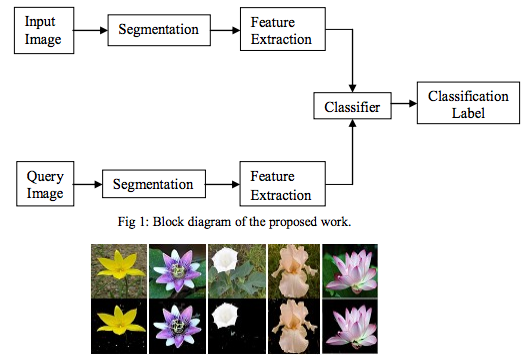
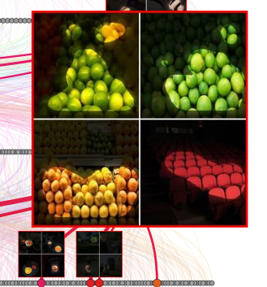

New to Caffe and Deep Learning? Start here and find out more about the different models and datasets available to you.

[Browse the IPython Tutorial](https://github.com/caffe2/caffe2/blob/master/caffe2/python/tutorials/Models_and_Datasets.ipynb)

## Caffe2, Models, and Datasets Overview

In this tutorial we will experiment with an existing Caffe model. In other tutorials you can learn how to modify a model or create your own. You can also learn how to generate or modify a dataset. Here you will learn how to find a model, what required files are involved, and how to test the model with a dataset.

## Models vs Datasets

Let's make sure you understand what is a model versus a dataset. Let's start with the dataset. This is a collection of data, any data, but generally has some kind of theme to it, such as a collection of images of flowers. To accompany this collection you will also need some labels. This is a file that talks about each of the images and provides some kind of description. For example, it could be the genus and species, or it could be the common name, or it could be descriptors of how it looks, feels, or smells, or some combination thereof. In the example below, Mukane & Kendule proposed a method of extracting the flower from the image using image segmentation and feature extraction to pull the main flower out of the training image, then their classifier uses texture features to do the matching.

A model is what is created out of the dataset when you run it through a neural network. This is called training, where the neural network and the computer running it "learns" from the dataset. It picks apart all of the features it can find on how to recognize salient objects in the images based on features similar to other examples in the dataset and commonalities between the labels and so forth. There are a variety of types of neural networks that are designed for particular purposes which can create more accurate models than others. In the case of flowers and creating a model that is good at identifying them accurately, we would pick a convolutional neural network. We would do the same for identifying pictures of places. Take a look at the interactive example below which shows the extracted regions that the network found in common and how they link together across the layers of the network.

## Evaluating a Model's Performance

A common practice in creating a model is to evaluate its performance using two factors often called accuracy and loss. Another way to look at this is:

- accuracy: how often is it right versus wrong
- loss: how often did it fail to recognize anything when it should have

Each use case has different tolerances for these factors. If you're powering an app to ID flowers, then a 92% accuracy rate is awesome; and if the loss is high, then you can rely on the user just trying a different angle with their camera until it works. If you're looking for tumors, 92% accuracy is pretty good, but if your loss is very high, you might want to work a little harder on the model since medical imaging on its own is quite expensive and not easy to ask for more images or diferent angles if your model fails to pick something up. Evaluating for these factors is accomplished by taking the dataset and splitting it up into two parts:

1. the first part is much larger and is used for **training**
2. the second smaller part is used for **testing**

### Splitting the Dataset

How the splits are decided or sampled, and how the labels are handled is something of another discussion. Suffice to say, think of this as an 80/20 percentage thing where you train on the 80 and test with the 20 and if the model does well on the 20 percent, then you have something you can use! "Does well" is subjective and up to you. You can get into optimizations like adjusting the dataset size, the labels, the neural network and its components, and hope to influence the speed of training, speed of detection, and accuracy, and other things that may or may not be of interest to you.

Many neural networking and deep learning tutorials use the MNIST handwriting dataset. When you download this dataset it usually comes ready to go in these parts, training and test, each with images and labels:

#### MNIST Training Dataset

* [train-images-idx3-ubyte.gz](https://github.com/caffe2/models/blob/master/mnist/train-images-idx3-ubyte.gz):  training set images (9912422 bytes)
* [train-labels-idx1-ubyte.gz](https://github.com/caffe2/models/blob/master/mnist/train-labels-idx1-ubyte.gz):  training set labels (28881 bytes)

#### MNIST Test Dataset

* [t10k-images-idx3-ubyte.gz](https://github.com/caffe2/models/blob/master/mnist/t10k-images-idx3-ubyte.gz):   test set images (1648877 bytes)
* [t10k-labels-idx1-ubyte.gz](https://github.com/caffe2/models/blob/master/mnist/t10k-labels-idx1-ubyte.gz):   test set labels (4542 bytes)

This dataset was split up 60/10 - 60,000 training images and 10,000 test images. Don't bother trying to open the files after unzipping them - they're not human-readable, rather they're in a format that requires parsing to be viewed. Further info on how the data was collected and formatted is on [this research site](http://yann.lecun.com/exdb/mnist/).

You can create a CNN using this dataset in the [MNIST tutorial](tutorial-MNIST.html).

### Caffe Model Zoo

One of the great things about Caffe and Caffe2 is the model zoo. This is a collection of projects provided by the Open Source community that describe how the models were created, what datasets were used, and the models themselves. In this way, you don't actually have to do any of the training. You can simply download the model. You can also download the training data and test data to see how it works and verify for yourself the accuracy of the model with the provided test data.

### Custom Datasets

It is a little trickier to test your own data though. We'll cover that in another tutorial once you get a handle of playing with the provided models and their datasets. It is good to note while you try these out that you can combine datasets, sample/subset them, and tinker with their labels. You might decide you want less info on the labels, or more. You might also not include labels on some of the training data. This has an interesting side-effect of actually improving model performance in some cases by letting the network make some guesses during training. Our way of categorizing and annotating features doesn't always map to how a computer's neural network would do it. "Over-fitting" your data can lead to negative performance for the network.

## Caffe Model Files

Let's jump into a specific example now that you have the overview. You will be looking at a small set of files that will be utilized to run a model and see how it works.

* .caffemodel or .pb2: these are the models; they're binary and usually large files
    * caffemodel: from original Caffe
    * pb2: from Caffe2
* deploy.prototxt: this is a json file that describes the design of neural network
* solver.prototxt: this describes the variables that were used during training
* train_val.prototxt:
* readme: this will have valuable info about how the model was trained and where you can find the model and dataset files

### Example Models

A small collection of pre-trained models is currently available at [caffe2/models on Gihub](https://github.com/caffe2/models):

* bvlc_alexnet
* bvlc_googlenet
* finetune_flickr_style
* squeezenet

### Run a Model

If you want to skip over training, let's take a [look at a model that was pre-trained](tutorial-loading-pre-trained-models.html). Then we're going to throw some of the test data at it and see what it does.
